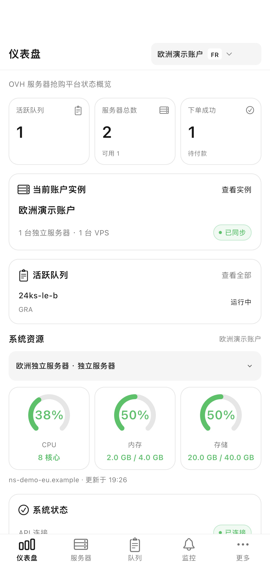
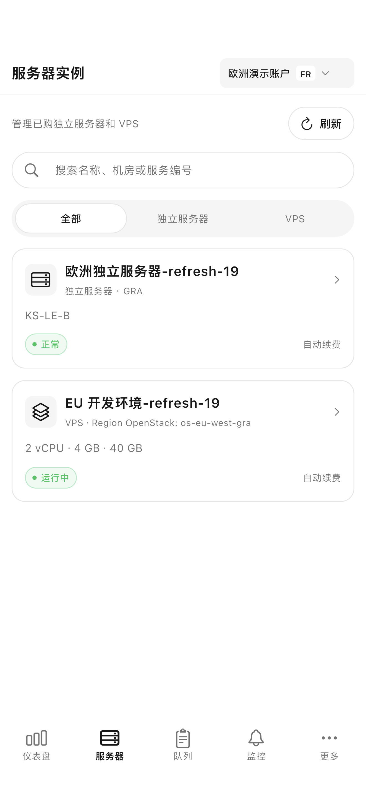
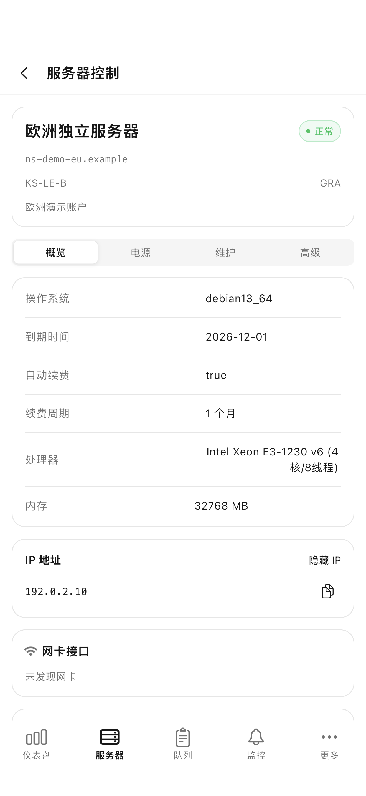

# OVH CP · Flutter 客户端 / SwiftUI 参考实现

新增 [Flutter 客户端 OVH CP](flutter/README.md)：iOS、iPad 和 Android 共用 Flutter/Dart 界面，同步接入原有后端与 226 项业务操作描述。底部服务器直接进入实例，首页资源位于活跃队列下方。1.3.0（15）iOS 沿用现有商店应用，已提交审核，正在等待 Apple 审核；Android 正式签名 APK 可从 [安卓下载网站](https://ovh.hejingcheng.com/download/) 或 [GitHub Release](https://github.com/RikkaBunny/ovh-ios/releases/tag/v1.3.0-cp.15) 下载。网站源码见 [website](website/README.md)。

SwiftUI 源码版本 1.2.0（9），最低 iOS 17，支持 iPhone 和 iPad。网站继续使用 React；此版本的业务页面全部使用 SwiftUI，共用现有 gokele/ovh Go 后端。已移除“完整控制台”网页入口。WebKit 仅用于 OVH 返回的 KVM 远程屏幕，不加载管理面板，也不注入面板令牌。

首次连接可扫描二维码、识别二维码图片、粘贴配对链接、填写 8 位配对码，或使用旧访问密钥。名称与图标保持 OVH，官方图标出处见 [BrandAssets/README.md](BrandAssets/README.md)。

仓库包含完整客户端、Xcode 工程、接口目录、单元与 UI 测试、本机合成测试服务、维护工具和测试截图。React 网页与 Go 后端由 [gokele/ovh](https://github.com/gokele/ovh) 单独维护，本仓库保留原后端，新增 [metrics-bridge](metrics-bridge/README.md) 为 Flutter 提供经过账户与实例归属验证的资源接口；其他机器未接入监控时显示未知。

## 界面预览

以下为 Flutter Build 15 截图，使用合成账户和演示数据。SwiftUI 参考截图保留在 `NativeScreenshots/`。

| 仪表盘 | 服务器实例 | 原生控制 |
|---|---|---|
|  |  |  |

## SwiftUI 1.2.0 历史参考

以下功能表、资源说明与构建方法属于保留的 SwiftUI 版本，当前发行的 Flutter Build 15 请参阅 [Flutter 文档](flutter/README.md)。

## 原生功能

| 网页页面 | iOS 原生入口与能力 |
|---|---|
| 仪表盘 | 状态、统计、面板宿主机 CPU/内存/存储圆环、当前账户实例、队列、快捷入口 |
| 服务器列表 | 更多 → 服务器库存；搜索与筛选、地区库存、配置选项、目录价格、购物车询价、创建抢购任务 |
| 抢购队列 | 当前/全部账户、状态筛选、重试间隔、暂停/恢复/删除、批量操作、耗时 |
| 服务器监控 | 订阅、库存变化历史、通知、自动抢购、检查间隔、引擎启停、全目录订阅 |
| VPS 补货 | 机型与站点、Linux/Windows、订阅、手动检查、通知、自动抢购 |
| 服务器控制 | 底部服务器 → 独立服务器；概览、IP、流量图、电源、救援、系统重装、任务预约、维护与全部高级操作 |
| VPS 控制 | 底部服务器 → VPS；概览、电源、系统模板、重装、快照、自动备份、续费、合同、网络与高级操作 |
| 账户管理 | 账户资料、余额、账单、退款、邮件、联系人变更与子账户 |
| 抢购历史 | 搜索、订单与付款状态、刷新状态、清理、详情与分享 |
| 详细日志 | 搜索、级别筛选、详情、分享、同步与清理 |
| API 设置 | OVH 账户、通知、重试设置、配对设备、缓存、系统资源与后端更新 |

高级操作使用 SwiftUI 表单、选择器、日期控件、结果卡片和操作确认。重装、终止、硬件更换、快照恢复要求核对服务名称。底部保留一套五栏导航，独立保留各栏位置；断开按钮位于设置的滚动内容末尾。

## 与网页保持一致

本次接口基线为 gokele/ovh `1011569d1d8935eeb028dcf2b48f9ff193b959e3`。`NativeCatalog.json` 描述 226 个业务 API 操作；配对兑换接口由 `Pairing.swift` 实现，内部监控询价接口不向手机开放。接口数量表示已接入的操作描述，不代表 226 个真实 OVH 操作都完成了线上验证。

两端共用账户、队列、订阅、历史、日志和设置。每个实例操作固定账户与服务名称；公开库存按 EU/CA/US 查询且不发送面板凭据。价格按网页的目录规则计算，月费、税费、安装费分开，币种来自目录，最终以下单报价为准。库存详情请求当前完整选配。流量图使用 OVH 原始单位，支持周期、网卡、方向、当前/平均/峰值和时间选择。

页面风格沿用网页：黑白主色、浅灰分隔、圆角卡片、胶囊按钮、绿色/橙色状态。iPhone 与 iPad 使用原生布局，位置不会逐像素复制桌面网页。少用的高级功能采用通用原生表单与卡片，和网页的专用弹窗结构不同。

修改后会刷新关联数据；队列与监控在可见页面定时更新，回到前台和手动刷新时同步。没有额外添加 APNs 推送；通知仍由后端现有 Telegram/Webhook 通道发送。

仪表盘通过与 React 相同的 `GET /api/system/metrics` 获取运行面板服务器的资源数据，每 2 秒刷新；离开仪表盘或进入后台时停止。三个圆环使用网页的 270° 圆弧和 60%/85% 颜色阈值。缺少容量、接口失败或无效读数显示未知状态，不显示伪造的 0%。该接口不是各 OVH 实例的系统代理指标。

## 凭据

配对使用 `POST /api/app/pair` 和 `{code, deviceName}`，返回独立设备令牌。之后使用 Bearer，与旧 X-API-Key 互斥；令牌只存本机 Keychain。撤销设备后，401 会清除本机凭据并返回配对页。

应用只在用户管理账户/API 设置时读取或编辑 OVH 凭据，不将它们保存到本机配置或应用资源中。设置更新先读取完整配置，保留未修改字段，读取失败时禁止保存；订阅更新只发送修改字段。Release 没有测试环境自动登录入口。

## 构建与测试

需要 macOS、Xcode 和 Python 3（仅测试/维护工具）。当前代码在 Xcode 26.4.1、iOS 26.4 模拟器验证；最低支持 iOS 17。无需第三方依赖。

```sh
git clone https://github.com/RikkaBunny/ovh-ios.git
cd ovh-ios
open OVHPocket.xcodeproj
```

选择 OVHPocket Scheme 和已有 iPhone 或 iPad 模拟器直接运行。模拟器使用正常的本地签名，关闭签名会导致 Keychain 保存失败。真机运行时，在三个 Target 的 Signing & Capabilities 中选择自己的 Team，并设置自己的 Bundle ID；仓库不含签名证书或描述文件。

```sh
xcodebuild -project OVHPocket.xcodeproj -scheme OVHPocket \
  -destination 'platform=iOS Simulator,name=iPhone 17 Pro' \
  -derivedDataPath build build
```

测试连接隔离的本机 HTTPS 演示后端，所有库存和操作效果均为合成数据。测试使用已有 QA 模拟器，不在真实账户上执行电源、重装、删除或购买。启动方法见 `Tools/README.md`，结果与限制见 `原生客户端验证.md`。旧版验证记录保留历史，不能用于证明当前版本。

## 连接自己的面板

先部署支持 App 配对接口的 [gokele/ovh](https://github.com/gokele/ovh) 后端，并通过 HTTPS 访问。此版本接口基线对应上游 v0.1.37；其他后端版本需要核对接口兼容性。

在网页「API 设置 → App 配对」生成配对码，打开 App 扫码或填写面板地址与 8 位码即可连接。App 与网页读取同一个后端数据，不需要再在手机里录入一套 OVH 账户密钥。支持撤销单独设备，也支持旧版访问密钥连接。连接与设置只保存在用户设备和自己的后端。

## 代码结构

| 目录 | 内容 |
|---|---|
| `OVHPocket/` | SwiftUI 页面、数据状态、网络、Keychain、配对、二维码扫描、图标和隐私清单 |
| `OVHPocket.xcodeproj/` | App、单元测试、UI 测试 Target 与共享 Scheme |
| `OVHPocketTests/`、`OVHPocketUITests/` | 认证、区域、参数、刷新并发和关键页面流程检查 |
| `Tools/` | 本机 HTTPS 测试服务、上游接口生成器与路由审计 |
| `NativeScreenshots/` | 使用合成数据的 iPhone/iPad 界面截图 |
| `BrandAssets/` | 图标原始资源和来源记录 |

## 后续维护

`Tools/generate_catalog.py` 从指定上游 checkout 生成接口描述和路由清单，并记录实际 Git commit。每次上游更新时检查生成差异、表单类型、新增页面与组合流程；通用表单不替代手工核对业务语义。`OVHPocketTests` 守住认证、区域、路径、价格、库存、模板、重装存储、枚举和更新保留规则，`OVHPocketUITests` 检查关键原生流程。

构建 9 统一所有页面下拉刷新任务，修复仪表盘和服务器实例被取消、失败清空数据和迟到响应覆盖的问题。构建 8 的目录、地区和缓存修复保留；专项验证见 [刷新问题修复.md](刷新问题修复.md)。源码版本号不表示已经通过 App Store 审核。

## 来源与许可

后端：[gokele/ovh](https://github.com/gokele/ovh)。本客户端采用 AGPL-3.0，保留上游许可与出处，见 `LICENSE`。本项目为自建服务客户端，与 OVHcloud 官方应用无关联。
