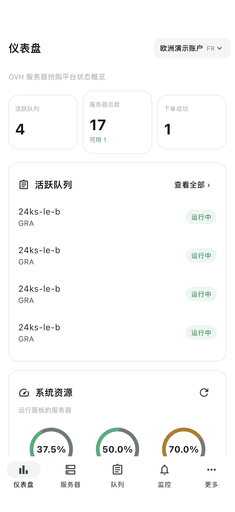
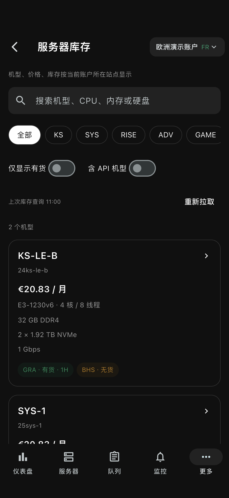

# OVH · Flutter 客户端

独立的 Flutter/Dart 版本，支持 iPhone、iPad 和 Android，版本 `1.2.0+1`。连接与 React 网页、SwiftUI 客户端相同的 gokele/ovh 后端，沿用黑白主色、灰色分隔、圆角卡片、胶囊按钮和状态色。业务页面全部由 Flutter 绘制；WebView 仅用于 OVH 返回的 HTTPS 远程屏幕。

Flutter 与现有 SwiftUI 应用使用独立 ID：iOS Bundle ID 为 `com.hejingcheng.ovhflutter`，Android Application ID 为 `com.hejingcheng.ovh_flutter`，可和原版同时安装。名称和图标仍为 OVH，图标来源见 [BrandAssets](../BrandAssets/README.md)。

## 界面预览

以下均为合成账户和演示数据。

| 仪表盘 | 服务器实例 | 深色库存 |
|---|---|---|
|  |  |  |

[iPad 仪表盘](screenshots/pad-01-Dashboard.png) · [原生控制确认](screenshots/phone-07-NativeControl.png) · [断开按钮](screenshots/phone-09-DisconnectReachable.png)

## 功能与后端

| 入口 | 功能 |
|---|---|
| 仪表盘 | 账户统计、活跃队列、CPU/内存/存储圆环、当前账户实例；资源位于活跃队列下方 |
| 服务器 | 当前账户的独立服务器和 VPS；硬件、IP、流量图、电源、维护、快照和高级操作 |
| 队列 | 当前/全部账户、搜索、状态筛选、重试间隔、暂停/恢复/删除及批量操作 |
| 监控 | 服务器订阅、变化历史、引擎启停、检查间隔、全目录订阅、通知与自动抢购 |
| 更多 | 服务器库存、VPS 补货、账户资料、账单、历史、日志、API 设置、设备配对 |
| 库存详情 | 区域库存、选配、目录月费/安装费、购物车报价、多机房数量和创建抢购任务 |
| API 设置 | 账户管理、完整配置更新、通知、缓存、后端系统、浅色/深色/系统外观 |
| 连接 | 摄像头扫码、二维码图片识别、粘贴配对链接、8 位配对码或旧访问密钥 |

接口目录与 SwiftUI 使用同一份 `NativeCatalog.json`，当前对应上游 `1011569d1d8935eeb028dcf2b48f9ff193b959e3`、226 项业务操作。较少使用的接口通过有类型的 Flutter 表单、结果卡片和关联操作接入。复杂操作的布局与网页专用弹窗有差异，功能依赖相应后端版本、账户权限和 OVH 实际可用能力。

两端共享后端的账户、订阅、队列、历史和设置。App 不保存另一套 OVH 账户数据库。通过 `POST /api/app/pair` 配对，独立令牌保存在 iOS Keychain / Android 安全存储；Bearer 与旧 X-API-Key 互斥。普通 API 不跟随重定向；公开 EU/CA/US 库存不发送面板凭据。401 清除本机连接，重新配对。

同一读取请求合并执行；下拉刷新等待真实完成。失败保留上次数据和成功时间，账户/连接切换阻止迟到响应覆盖新数据。设置先读取完整配置，更新时保留其他字段；读取失败禁止保存。重装、终止等操作需输入服务名称确认。抢购任务明确展示账户、机房、数量和自动付款选项。

资源圆环显示运行面板的服务器，通过 `/api/system/metrics` 获取，不是各 OVH 实例的代理指标。前台仪表盘每 2 秒更新，队列和监控在对应根页面每 10 秒更新。未加入 APNs/FCM；通知继续使用后端 Telegram/Webhook 等通道。

## 运行

需要 Flutter 3.38+、Dart 3.10+；本机环境为 Flutter 3.44.6 / Dart 3.12.2 / Xcode 26.4.1。iOS 最低 17.0。Android 使用现有 SDK 和 JDK 17。

```sh
git clone https://github.com/RikkaBunny/ovh-ios.git
cd ovh-ios/flutter
flutter pub get
flutter devices
flutter run -d 你的设备ID
```

现有机器的 SDK 路径为 `/Users/hejingcheng/Documents/多端邮箱聚合器/.tools/flutter/bin/flutter`，可使用完整路径执行以上 Flutter 命令。

在网页「API 设置 → App 配对」生成配对码，打开 App 扫描或填写 HTTPS 面板地址和 8 位码。所有业务信息通过同一个后端同步。模拟器可使用二维码图片、粘贴链接或配对码；实体相机需要真机验证。

```sh
flutter build ios --simulator --debug
flutter build ios --release --no-codesign
flutter build apk --debug
```

只构建 arm64 测试包：`flutter build apk --debug --target-platform=android-arm64 --split-per-abi`。ABI 拆分构建会按 Flutter 规则调整 Android versionCode，源码版本仍为 `1.2.0+1`。

真机与商店发布需要选择自己的 Team、Bundle ID 和签名；在 `ios/Runner.xcworkspace` 打开 iOS 工程。Android 当前 release 模板使用开发签名，仅用于本机构建；公开发布前配置自己的上传密钥。仓库不包含签名证书、生产密钥或真实令牌。本次 Flutter 版本未提交应用商店。

## 测试

```sh
flutter analyze
flutter test
```

UI 测试使用根目录已有的 HTTPS 合成服务，启动方式见 [Tools/README.md](../Tools/README.md)。测试不连接 OVH，不对真实服务器执行操作。选择专门用于测试的现有模拟器。

```sh
# 在仓库根目录启动服务，另一个终端执行：
cd flutter
OVH_SCREENSHOT_DIR=artifacts/screenshots/phone flutter drive \
  --driver=test_driver/integration_test.dart \
  --target=integration_test/acceptance_test.dart \
  -d QA模拟器ID --dart-define=OVH_QA=true
```

`OVH_QA=true` 仅在 Debug 下生效，自动连接 localhost:16443，并且仅对这个地址接受本机测试证书。Release 不启用测试自动连接，也不接受此 TLS 例外。

检查覆盖凭据、区域、226 项描述解析、价格、库存、刷新并发、失败保留、账户隔离、危险操作确认和配置保留。模拟器验证资源位置、库存任务参数、监控、US VPS、Keychain 令牌恢复及滚动到断开按钮。真实 OVH 重装/付款/KVM、实体相机及硬件接口逐项验证不属于此次合成测试的结果。详见 [验证记录](验证记录.md)。

## 维护

| 文件 | 职责 |
|---|---|
| `lib/core/api.dart` | 认证、配对、普通请求、公开区域库存 |
| `lib/core/store.dart` | 连接、账户、状态缓存、读取合并、迟到响应隔离 |
| `lib/core/models.dart` | 类型转换、区域、价格、库存、字段与路由描述 |
| `lib/ui/` | Flutter 页面、表单、图表和确认 |
| `assets/NativeCatalog.json` | 与现有客户端相同的业务 API 描述 |
| `test/`、`integration_test/` | 单元回归和实际模拟器交互 |

上游更新后，先用根目录 `Tools/generate_catalog.py` 生成并检查接口差异，再将 `OVHPocket/NativeCatalog.json` 同步到本目录 `assets/NativeCatalog.json`，核对业务类型与新增页面，运行单元和 UI 测试。共用描述不自动保证新增业务流程完全一致，仍需核对参数、权限和交互。

本客户端采用 AGPL-3.0，见根目录 [LICENSE](../LICENSE)。保留 [gokele/ovh](https://github.com/gokele/ovh) 来源；本项目为自建服务客户端，与 OVHcloud 官方应用无关联。
