# 2026-10-04 · 明确自建服务的使用前置条件

首页、安装与配对区、FAQ、下载区和页脚补充用户需先在自己的 VPS 部署 `gokele/ovh` 服务的说明，提供上游项目与部署文档链接。配对前需配置 OVH 账户和手机可访问的 HTTPS 面板地址，并确认服务具备「API 设置 → App 配对」入口；没有该入口时先更新服务。同步更新搜索与社交摘要，保留浅色主题、现有 App 截图和功能插图。

- 实际 Chrome 桌面 1141px、手机 390px / 360px 检查无横向溢出；前置条件卡片、项目按钮和部署文档链接排版正常。首页与下载区的说明链接均定位到卡片，卡片顶部位于导航下方 96px；手机菜单导航后关闭。
- 公网 Chrome 刷新后加载新版内容，未捕获页面警告或错误；测试视口和模拟偏好已恢复。截图取自发布后的官网。
- 沿用 1Panel OpenResty 静态目录原子发布，仅更新 HTML / CSS，无需重载配置；发布前配置检查通过。源站 HTTPS 的两个文件逐字节校验一致，HTML SHA-256 为 `abc1784df35b7b372487933d8ba90af48a13501e77fff3c4ef01a723d5728ce0`，CSS 为 `8baa4d44ef62fce4b43dd650c4f74b6abf262263cc979024eee2afc4a430c9a6`。
- 公网 HTML 已包含前置条件与上游链接，CSS 与源码一致。原控制台 API 健康正常，正式 APK SHA-256 未变；公网范围下载返回 206、1,024 字节及正确总长度 75,268,472 字节。
- 回滚快照：`/opt/1panel/backups/ovh-cp-download/20261004T043519Z-prerequisites`。文档与验证截图仅保存到仓库。

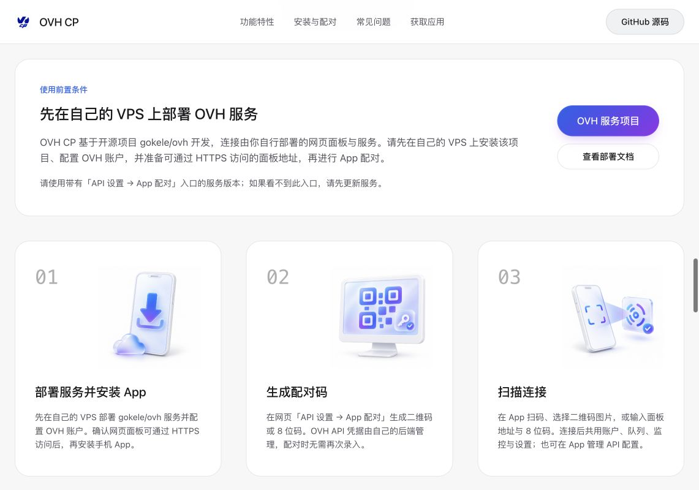

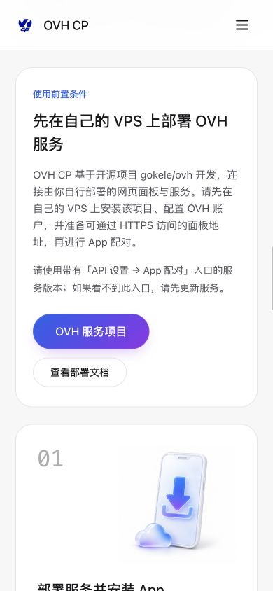

---

# 2026-10-04 · 五张功能插图统一风格

使用内置图像生成工具替换任务和全球账户的代码绘制大图，并为安装、生成配对码、扫码连接增加配套插图。五张均为纯白背景、白色瓷质与磨砂玻璃、蓝紫点缀；后三张以任务插图为风格参考。真实 App 截图、应用图标与可扫描的下载二维码保持原资源。生成提示词与最终素材路径见 [插图记录](artwork/README.md)。

- 五张 WebP 共 299,992 字节，保留原构图，使用延迟加载、固定宽高比、装饰空 alt；配对步骤仍有完整的编号和文字说明。
- Chrome 桌面 1141px、手机 390px / 360px 检查通过，未发生横向溢出；配对三张图和五张图的线上加载确认通过。页面未捕获错误或警告，测试视口及模拟偏好已恢复。
- 1Panel OpenResty 原子发布并重新加载，配置检查通过，只增加五张 WebP 的具体公开路径，MIME 为 `image/webp`。源站 HTML、CSS 与五张图逐字节校验通过，公网 CSS 与五张图也与源文件一致。HTML SHA-256 为 `be64bf46a07256ac50fc5102cbd9932d606d6f51321523881ed9dff3e8c3c467`。
- 原控制台 API 健康正常；正式 APK 未变化，范围请求继续返回 206、1,024 字节、正确总长度 75,268,472 字节。`artwork/README.md` 公网返回 404。
- 回滚快照：`/opt/1panel/backups/ovh-cp-download/20261004T041944Z-illustrations`。

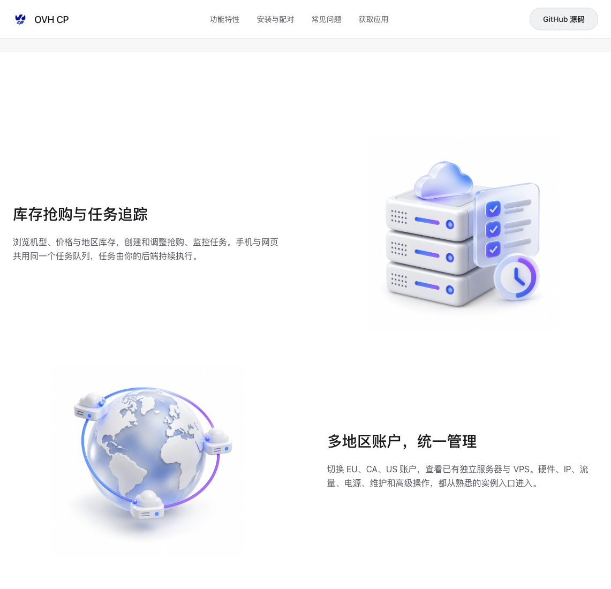

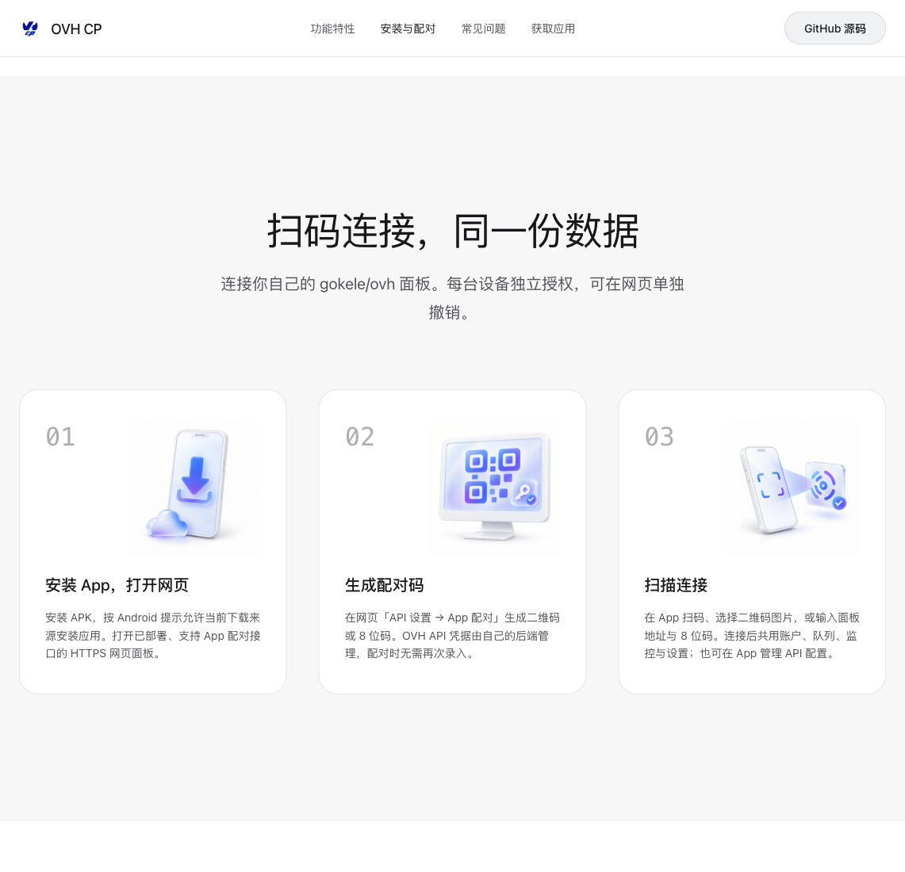

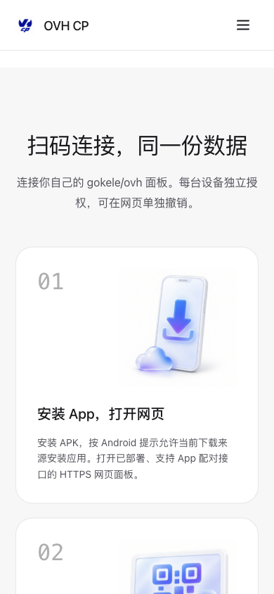

---

# 2026-10-04 · 官网与 App 示例统一浅色

根据用户要求，官网改为固定白色 / 浅灰主题，与现有三张真实浅色 App 截图统一。保留蓝紫点缀、布局和截图切换；导航、首屏 Canvas、展示边框、下载卡片和页脚均改为浅色。Canvas 共用页面背景色，使用普通混合保持粒子可见；HTML 浏览器主题色改为白色，样式和脚本版本参数更新为 `light-20261004`。

- 桌面 1141px、手机 390px / 360px 的实际 Chrome 检查通过，无横向溢出。深色系统偏好下官网仍为浅色；减少动画偏好正常。截图切换、手机菜单与 FAQ 展开正常，线上未捕获页面警告或错误。
- 当前 Chrome 已能正常打开新官网，刷新后加载新版主题，三张 App 截图正常加载；前次记录中的浏览器连接问题本次未复现。测试视口与系统偏好模拟已恢复。
- 现有 1Panel OpenResty 静态目录原子更新，配置检查通过；源站 HTTPS 的 HTML、CSS、JavaScript 字节与源文件一致。HTML SHA-256 为 `b9ff7583f2b921904c50169efb3de0aab45fd84e71866f473b1506d415cabcb2`。
- 公网 CSS / JavaScript 与源码逐字节一致，HTML 包含新版主题与资源版本；原 Cloudflare 交付脚本仍保留。APK 未更换，源站 SHA-256 与 Build 15 一致，公网范围下载返回 206、1,024 字节，总长度 75,268,472 字节。原控制台 API 健康正常。
- 回滚快照：`/opt/1panel/backups/ovh-cp-download/20261004T041032Z-light-theme`。文档与验证截图只保存在仓库，不发布到公开静态目录。

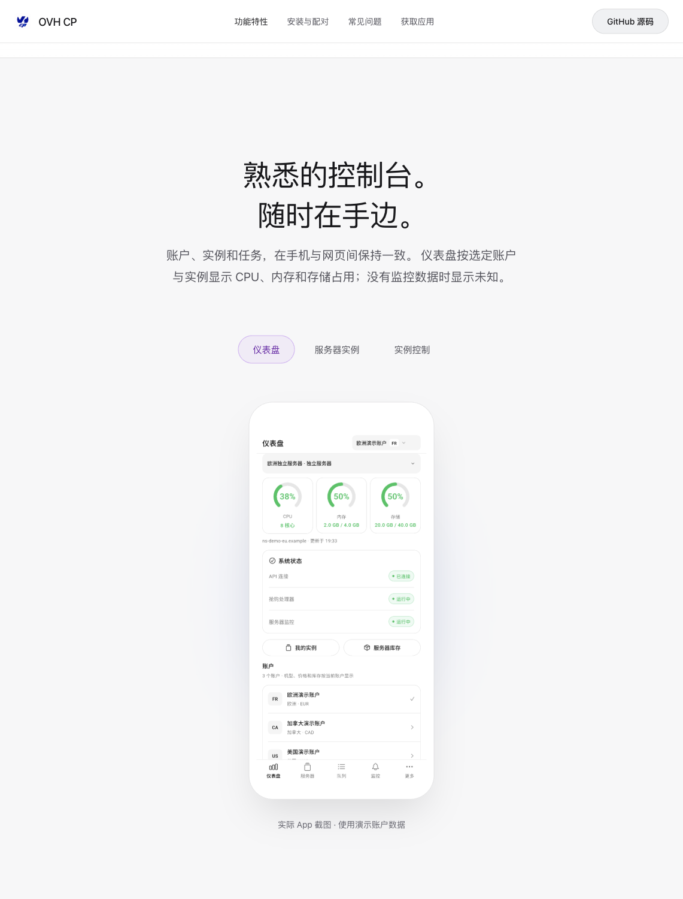

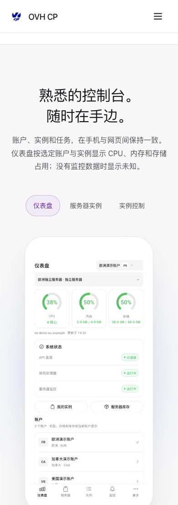

---

# 2026-10-04 · 官网独立域名

官网入口更新为 <https://ovh.gamelife.life/>。Cloudflare 的 `ovh.gamelife.life` 记录指向现有 KS-LS-B 服务器并开启代理；沿用 1Panel OpenResty，独立静态 vhost `ovh-cp-site.conf`，Let’s Encrypt 证书有效至 2027-01-01，并安装续期部署钩子。当前版本与正式 APK 未变更。

- 更新 canonical、Open Graph URL、图标绝对地址、下载二维码、当前 README 链接与 GitHub Release 下载说明。
- 旧 `ovh.hejingcheng.com/download/` 路径返回 301 到新域名，保留资源路径与查询参数；原控制台 API 健康检查正常。
- 源站完整 HTTPS 校验通过，HTML SHA-256 `5a73587b69ff4108d13eb15da8f3b6f0868ce94aa01e49bd2ae8baafe946ab7f` 与源码一致。两个实际 Cloudflare 公网 IPv4 入口均返回 200，保留原主机名与 TLS 校验。
- 样式、脚本、版本元数据、校验文件、图标、二维码与三张截图的公网字节均与源码一致。完整 APK SHA-256 仍为 `3d53722193de85eca702928cdf7eeda92aa976b41a039ab2f852a9c3ed70d34d`；范围请求返回 206，长度与 MIME 正确。非公开文档、Git 路径和后端 API 路径返回 404。
- 主站 <https://www.hejingcheng.com/> 顶部导航在“游戏厅”后新增 OVH，链接新官网；导航源配置已提交到 `RikkaBunny/bunny-nexus-main-site`。补齐仓库未同步的既有工具箱入口与博客地址；比较原公网页面，首页原文案和链接完整保留。Astro 构建通过，22 个生成页面的导航已验证；桌面和 390px 手机菜单的实际浏览器检查通过，无横向溢出，测试视口已恢复。
- 本次主站通过已核实的新服务器 SSH 连接直接部署。原 GitHub Actions 部署目标与主机身份记录已更新，但旧部署密钥未迁移，新服务器拒绝该旧密钥，因此自动上传步骤仍失败。
- 本机当前 `vmrack-la` 代理对新域名的普通浏览器访问仍返回连接中断；本地解析返回正确 Cloudflare 地址，两个公网入口与源站的独立校验正常。尚未将浏览器访问该官网标记为通过，也没有修改代理路由或关闭 TLS 校验。

官网回滚目录：服务器 `/opt/1panel/backups/ovh-cp-download/20261003T175002Z-gamelife-domain`。主站最终回滚目录：`/opt/1panel/backups/bunny-nexus/20261003T180224Z-ovh-navigation`。

---

# 2026-10-03 · OVH CP Build 15

仪表盘资源说明改为按当前账户与选定实例显示，未接入监控时明确未知。产品截图替换为 Build 15 Android 回归截图，图像查询参数 resources-15；白底图标与 OVH CP 名称保留。APK 75268472 字节，SHA-256 `3d53722193de85eca702928cdf7eeda92aa976b41a039ab2f852a9c3ed70d34d`。iOS Build 15 已提交，等待审核，通过后自动发布；原内部组可测试。

1Panel OpenResty 原子部署、配置检查与 reload 成功。源站 HTML SHA-256 为 `aae68c3fd2012eb6e9fdae5342a3044805a46d936d32c3c51944b49e226f1c1c`，与源码一致。公开样式、脚本、版本元数据、校验文件、图标、二维码和三张产品截图与本地字节一致。Chrome 实际下载完整 APK 的 SHA-256 与发行包一致；MIME、文件名、75268472 字节和 Range 206 均验证。390px 手机无横向溢出，临时视口已恢复。原面板 API 健康正常，旧版下载与回滚备份保留。

回滚目录：服务器 `/opt/1panel/backups/ovh-cp-download/20261003T114050Z-resources-15`。

---

# 2026-10-03 · OVH CP Build 14

白底图标、全大写名称保留；产品预览替换为本次 Android UI 回归截图，图像引用添加 parity-14 版本参数。APK 1.3.0（14）为 75252044 字节，SHA-256 007b24266a4e3ca45ceee6f33060af7c7df1c851a9b18eb2a25789012e9e2e90。iOS 当前等待 Apple 审核，通过后自动发布。

通过 1Panel OpenResty 原子更新、校验和回滚备份发布。公网页面静态资源与源文件相同；HTML 的差异仅为原 Cloudflare 添加的交付脚本。Chrome 实际下载与最终 APK 校验一致。APK 附件 MIME、名称、长度、Range 206 检查通过，原控制台 API 健康正常。390px 手机预览确认白底标识和新版实例控制截图，截图切换可用，临时视口已恢复。

---

# 安卓下载网站验证

## Gemini 科技产品官网重设计 · 2026-10-03 16:51

根据用户新的视觉要求，实际查看 Gemini 官方产品站，并在用户 Chrome 的 Gemini Pro Canvas 中重新生成和精修。采用纯黑主题、居中大标题、蓝紫 3D 粒子主视觉与真实 App 截图舞台，替换之前的网格与功能卡片设计。

- 保留生成的视觉与粒子投影算法，补齐被截断的动画循环；页面不可见或离开首屏时取消动画，减少动态效果时保留静态主视觉。
- 样式与脚本外置，剩余内联样式改为 CSS 类；无外部运行时、字体或新增网络请求。
- 1141px 桌面、390px / 360px 手机无横向溢出；截图保持原比例。移动菜单、Escape、导航自动关闭、截图鼠标和方向键切换、FAQ 展开通过。
- 复制 SHA-256 后，在本地临时验证页实际粘贴得到正确的 64 位校验值；验证页已删除。
- 禁用 JavaScript 后没有隐藏正文，两个主 APK 链接保持可用；减少动画时文字与静态粒子图正常显示。
- 公网 CSS、JS、版本元数据、校验文件、图标、下载二维码与本地字节一致，浏览器未捕获错误或警告。
- 从新版官网实际下载完整正式 APK：75,507,618 字节，SHA-256 与原发布包一致；Range 请求仍返回 206。
- 源站 HTTPS 页面与本地 HTML SHA-256 完全一致：`006179b1bd86f5dcf0cd1f66a7743c6ea52ad457523afb4304a85cbb24ab9c94`。后端健康检查仍为 `status: ok`。
- 沿用 1Panel OpenResty 静态路径，回滚保存在服务器 `20261003T085137Z-gemini-v2/site` 快照；正式 APK 与签名材料未变更。

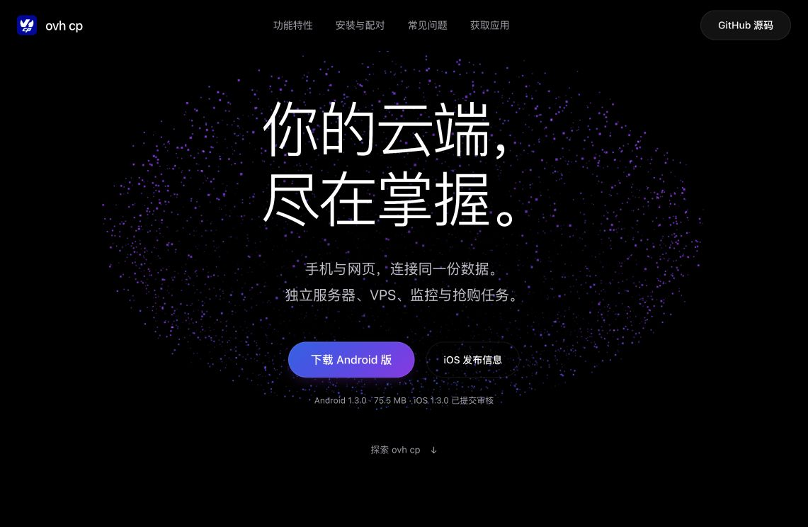

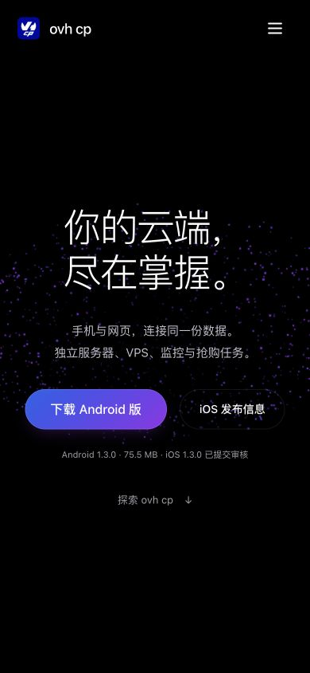

以下为此前设计与下载服务的历史验证。

## Gemini 官网更新 · 2026-10-03 16:24

通过用户已登录的 Chrome Gemini Pro Canvas 生成完整官网初稿，再接入现有 `/download/`。保留 Gemini 的网格、光晕、蓝色渐变、产品截图和不同尺寸功能卡片，校正过度宣传文案，完善部署与交互。

- 将样式与脚本外置，兼容现有 CSP；静态文件校验通过，没有修改后端与 OpenResty 路由。
- 1141px 桌面、390px / 360px 手机无横向溢出；深色、浅色、减少动画偏好检查通过。
- 移动菜单展开、导航后关闭、Escape 关闭、截图鼠标/键盘切换、FAQ 展开及校验值复制通过。
- 禁用 JavaScript 后，全部正文仍可见，主要 APK 链接可用。
- 公网 CSS、JavaScript、版本信息和二维码与本地内容一致；浏览器未捕获页面错误。
- 再次从新官网实际下载正式 APK，75,507,618 字节及 SHA-256 与原发布包一致；范围请求仍返回 206。
- 页面源文件 SHA-256：`a9639abbbd5d4866a8d5cd12b975420f15d778e6c1e9e0fa91a44aab6df49d5d`。源站 HTTPS 响应与该文件完全一致，面板健康检查正常。
- 回滚保留在服务器本次发布快照中，正式 APK 与签名资料未变更。

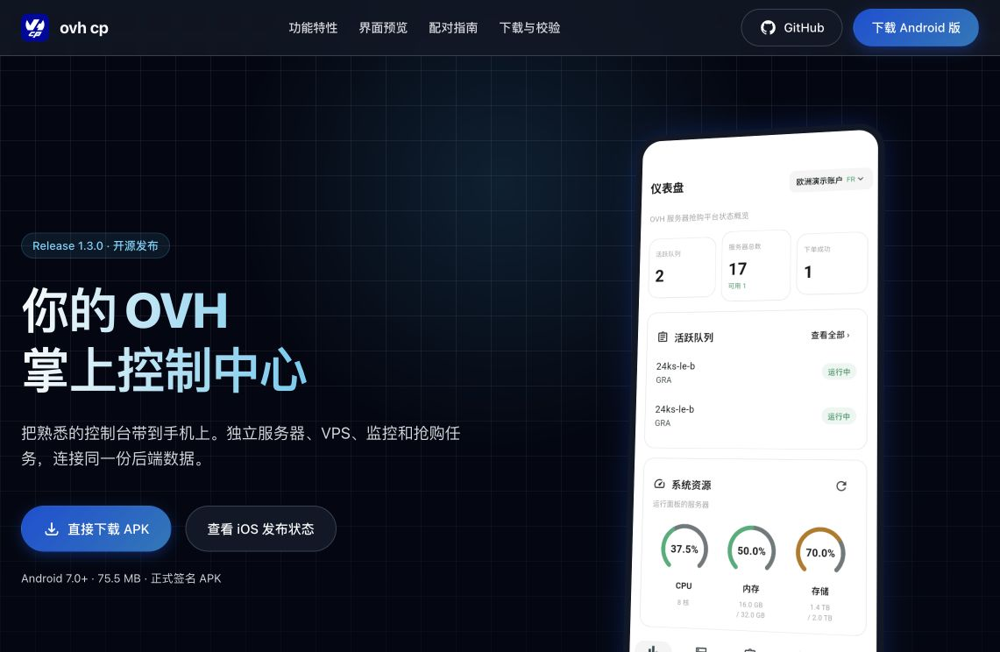

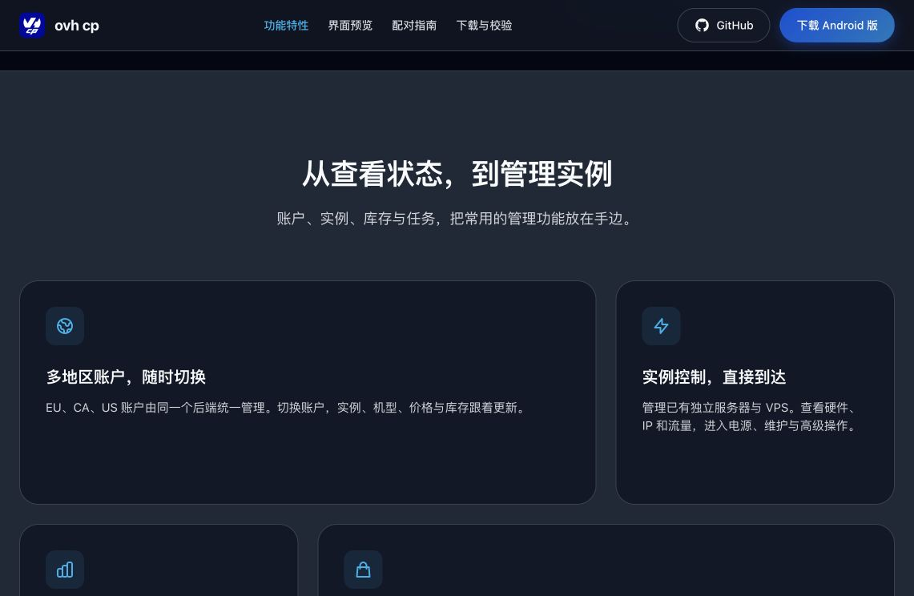

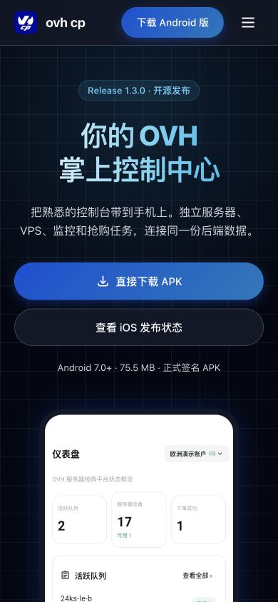

以下为初版网站验证与历史截图。

2026-10-03 部署至 <https://ovh.hejingcheng.com/download/>，沿用现有 1Panel OpenResty、域名与 HTTPS。

## 正式安装包

- `ovh-cp-1.3.0-11.apk`，版本 1.3.0，versionCode 11，包名 `com.hejingcheng.ovh_flutter`。
- 75,507,618 字节，最低 SDK 24（Android 7.0），目标 SDK 36；arm64-v8a、armeabi-v7a、x86_64。
- SHA-256：`c2bfe133850f390ecfd0e272fa7248ccf84d8effb45349bf606ba60032339010`。
- Chrome 从页面下载按钮对应链接获取完整 APK；文件大小与哈希和原始正式签名包一致。本次验证下载，没有重新在实体手机安装。

## 网络与页面

- OpenResty 配置检查通过、配置已持久化并重新加载；面板健康接口返回 200 / `status: ok`，原控制台仍返回 200。
- 公网页面、CSS、JavaScript、版本元数据、图标、二维码、三张截图及校验文件正常加载。静态资源与本地源文件一致；HTML 经 Cloudflare 加入其现有检测脚本。
- APK HEAD 返回 200，MIME 为 `application/vnd.android.package-archive`，`Content-Disposition` 指定附件下载和正确文件名，长度 75,507,618。
- `Range: bytes=0-1023` 返回 206、1,024 字节及正确 `Content-Range`，支持范围下载。
- `/download` 重定向至 `/download/`；不存在的 APK 和隐藏文件路径返回 404。
- 桌面 1141px、手机 390px / 360px 无横向溢出。截图切换、方向键切换、FAQ 展开、校验值复制通过；公网浏览器检查未捕获页面错误。
- 下载二维码打开本下载页；用户连接 App 的配对二维码由自己的网页控制台生成。

## 上线截图

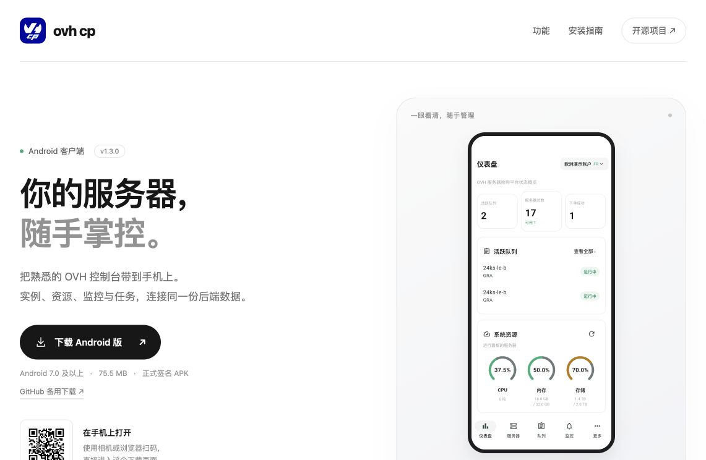

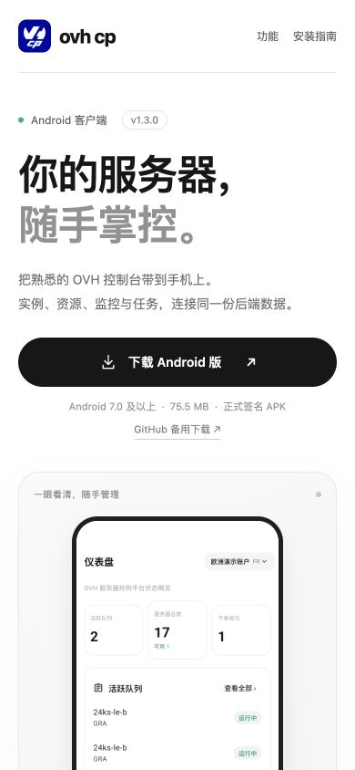
