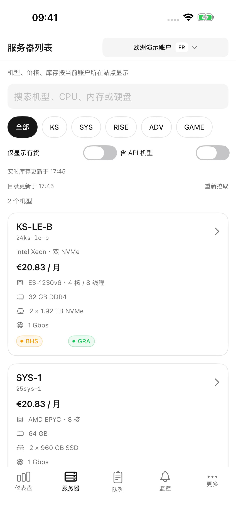
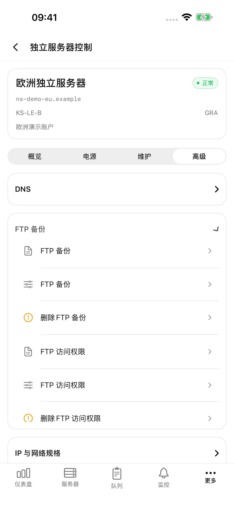
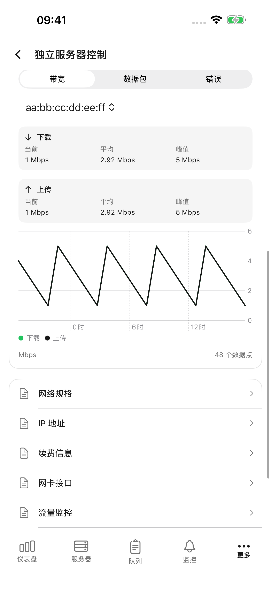
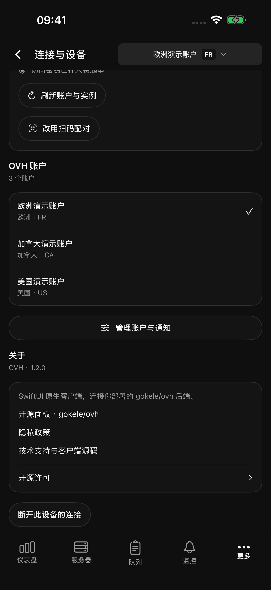
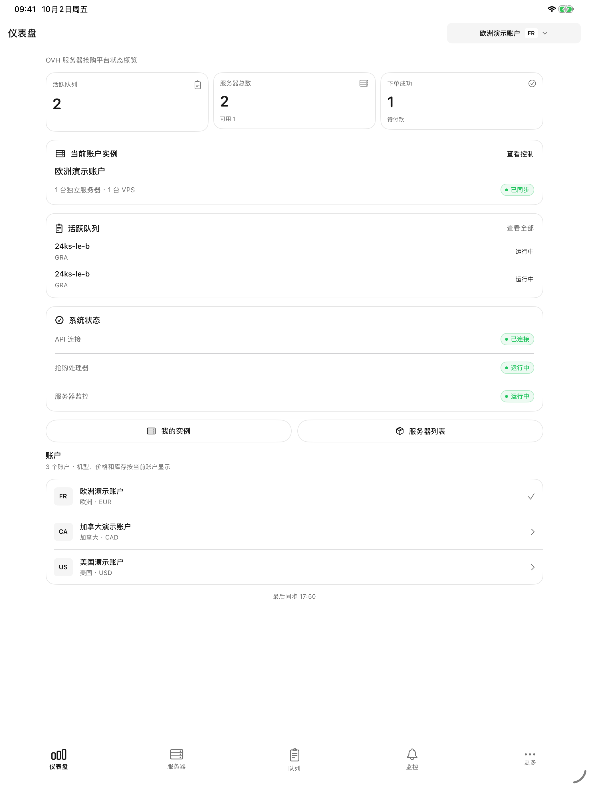
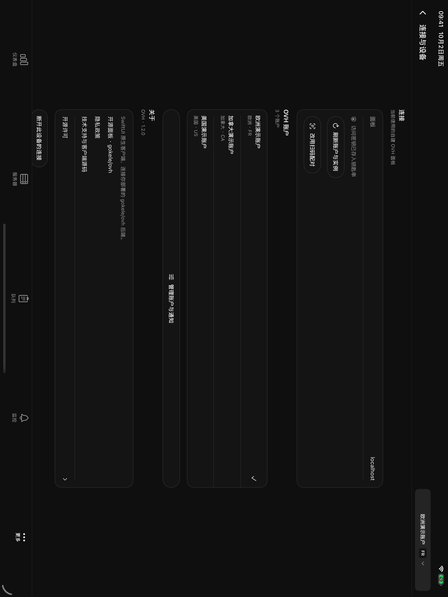
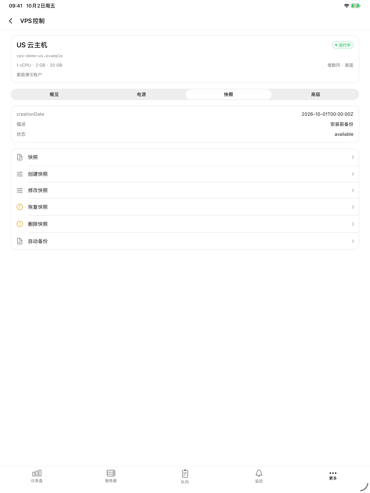

# OVH 1.2.0 原生客户端验证

当前源码：1.2.0（9），2026-10-03。构建 9 的 30 项单元检查、5 项 iPhone UI 流程和 3 项 iPad 刷新专项流程通过；刷新修复、证据范围和未通过的旧版 iPad 横屏用例见 [刷新问题修复.md](刷新问题修复.md)。测试结果包和发行签名产物保留在本地，不加入公开仓库；下列截图均来自合成测试账户。

下方保留构建 7 与构建 6 的历史验证，不能代替构建 9 的专项验证。构建 7 验证环境：2026-10-02 19:40，Xcode 26.4.1，现有 iPhone QA 和 iPad Pro 13-inch（M5），iOS 26.4 模拟器。

## 构建 7：首页资源与实例导航

- 20 项单元/接口检查通过，包含资源响应形状、真实 0% 与未知读数区分、缺失容量、字节格式与 60%/85% 颜色边界。
- iPhone 4 项 UI 流程通过：首页资源成功/503/恢复、离开首页后停止轮询；底部实例包含独服与 VPS；更多中仍能进入库存抢购；独服高级控制、队列、监控及 US/CA 切换。
- iPad 2 项 UI 流程通过：同一首页/实例/库存流程、横竖屏切换、深色首页与实例列表。已检查导出截图，圆环、标签和容量信息未溢出。
- 日常 iPhone 17 Pro 覆盖安装构建 7，保留现有配对和账户，通过正式面板接口实际读取首页 CPU、内存和根分区占用；没有执行真实 OVH 写操作。
- 指标是运行面板的宿主机资源，与 React 的 `GET /api/system/metrics` 相同；不表示每台受管 OVH 实例的资源占用。
- 系统资源已按要求移至活跃队列下方；最终布局分别通过 `Build7-FinalLayout-Phone.xcresult`、`Build7-FinalLayout-Pad.xcresult` 的现有首页/实例/库存检查，保留成功、失败恢复与横竖屏截图。
- 构建 7 于 2026-10-02 19:50:22 上传成功，19:52:32 Apple 通知内部 TestFlight 可测试。发行 IPA 严格签名检查通过，`get-task-allow=false`，隐私清单存在。上传和 TestFlight 不代表审核通过或公开发布。

证据：`work/native-parity/Build7-Phone.xcresult`（20 项单元），`Build7-PhoneUI.xcresult`（4 项 iPhone UI），`Build7-PadUI.xcresult`（2 项 iPad UI）。截图在对应 `Build7-Phone-Attachments`、`Build7-Pad-Attachments`；实际面板首页截图在 `AppStore/Build-7-Dashboard-live.png`。

## 构建 6 历史记录

以下保留 1.2.0（6）的完整迁移验证，不能代替构建 7 的本次验证范围。

## 环境与边界

接口基线 `1011569d1d8935eeb028dcf2b48f9ff193b959e3`。隔离测试后端监听 `https://localhost:16443`，使用合成 EU、CA、US 账户、机型、订单和实例，所有写操作均为演示效果。工具不连接真实 OVH。源码保留可复现的生成器、演示后端与测试。

旧版业务网页容器已删除，仅保留 KVM 远程屏幕的 WebKit。UI 测试检查关键业务页没有 WebView。正常本地签名保证 Keychain 可以持久化。

## 单元与接口检查（18 项）

- HTTPS 地址验证、拒绝凭据 URL、认证头互斥、旧 Keychain 迁移。
- 二维码实际图片解码、配对协议、请求体与一次性码不进入 URL。
- 多地区 VPS 数据与币种、路径/查询编码、不允许覆盖固定账户。
- 226 项操作描述唯一性、字段位置、真实 VPS 字符串模板与独服重装存储结构。
- 终止、合同、SPLA 枚举及救援 SSH 公钥的类型。
- 有货状态、公开库存变体合并、addon 前缀边界。
- 目录月费不包含安装费，税费/安装费分开且币种来自目录。
- 流量原始嵌套数据、缺失值、网卡、bps 与 Mbps 换算。
- 对隔离后端实际保存配置、修改订阅，验证未改凭据、库存、机房和选项保留；空代理地址作为明确的清空操作发送。

## UI 流程（5 项）

1. 原生仪表盘 → 机型价格/库存 → 抢购确认取消/创建 → 队列 → 监控订阅表单。
2. 独服概览 → 原生流量图 → 电源操作确认取消 → 维护 → 高级 FTP 备份 → 抢购历史。
3. 切换 US/CA 账户 → VPS 快照 → 镜像模板 → 重装确认（未输入服务名不能提交）→ 加拿大实例。
4. 读取账户现有代理 → 清空并核验后端 → 修改设置并核验后端 → 生成配对码 → 断开 → 实际兑换设备码 → 重启恢复 → 撤销设备后返回配对。
5. 深色界面、纵横屏、滑到底部保持、不固定断开按钮、断开取消与实际断开。

## 测试中修复的问题

- 原生导航行中 Spacer 的空白区域没有点击范围，已为整行设置点击区域。
- 配置输入控件的辅助标识被父容器覆盖，已保留独立字段标识与分组。
- VPS 快照详情被通用折叠层包住，现直接显示快照内容。
- 图表的默认拖动选择影响上下滚动，改为点按选择时间点。
- 目录缓存与实时库存区分，强制刷新、更新时间和失败提示可见。
- 救援 SSH 公钥与 VPS 重装密钥的类型区分，IPMI 地址读取实际 console.value 字段。
- 账户编辑读取当前值，隐藏已遮蔽的凭据；清空代理地址会发送空字符串，未修改的 API 凭据不写回。

## 真实服务验证与未覆盖内容

日常 iPhone 17 Pro 模拟器覆盖安装后，原有配对恢复成功，真实后端仪表盘显示 WE 账户、99 个机型、57 个可用、1 台独服（2026-10-02 18:19）。没有在真实账户执行电源变更、付款、重装、销毁、硬件更换或快照恢复。真实 KVM 协议、地区/机型特有高级权限、实体 iPhone 相机、最低 iOS 17 运行时尚未验证。

本次只改 iOS 客户端，未修改线上 React 页面或后端，不替换此前提交审核的 1.1.1（5），不代表 1.2.0 已上传或公开发布。

## 已完成结果

- iPhone QA：18 项单元/接口检查、5 项 UI 流程全部通过，0 失败、0 跳过。
- iPad Pro：18 项单元/接口检查、5 项 UI 流程全部通过，0 失败、0 跳过。
- Release 真机 ARM64 编译通过；这次为未签名编译检查，未安装到实体设备。
- 结果包：工作目录 `work/native-parity/NativePhone-Acceptance.xcresult`。
- iPad 完整结果：`work/native-parity/NativePad-Acceptance.xcresult`。
- 最后账户表单调整后的 18 项单元/接口检查通过；新增代理清空及完整设备配对流程在 iPhone 上通过。
- 最终独立单元检查：`work/native-parity/NativeUnit-Final.xcresult`，18 项通过、0 失败、0 跳过。
- 新增代理清空及完整设备配对流程在 iPad 上也通过，见 `work/native-parity/NativePad-FinalRegression.xcresult` 的对应通过项。
- 加强横屏检查后，专用 iPhone 模拟器曾不响应旋转。保留数据重启后，实际窗口已完成横屏/竖屏切换，断开流程回归通过；截图等待窗口方向和布局稳定后采集。结果：`work/native-parity/NativePhone-RebootRegression.xcresult`。
- iPad 连续自动化运行也曾出现物理方向 unknown、界面不旋转的模拟器状态。保留数据重启后，实际横屏/竖屏与断开流程回归通过，见 `work/native-parity/NativePad-RebootRegression.xcresult`。复现时先确保模拟器正常响应旋转，必要时重启专用测试设备；此问题未通过强制应用方向来绕过。
- 修复前的失败结果仍留在工作目录供追溯，不用于代表最终结果。

## iPhone 截图

## iPad 截图

